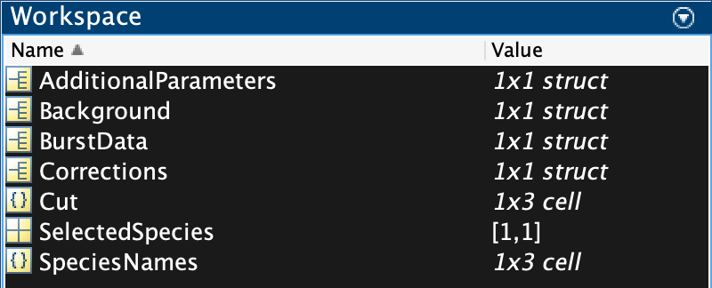

# PAM burst file

## .bur file format

The .bur file stores the burst data in binary MATLAB file format. Only the burst-integrated photon counts, burst duration and derived quantities are stored. Additionally, meta-data about the processing (burst selections, correction factors, ...) are stored in the file. The raw photon data (macrotime, microtime, channel) is stored in a separate binary file, used for processing the data for PDA (constant time binning), burst-wise FCS and filtered-FCS or sub-ensemble TCSPC analysis.

Contents of a .bur file:



* BurstData: array of the burst data (see csv file description below), stored together with all meta-data (burst serach settings, IRF patterns, PIE channel boundaries, ...)
* Corrections: correction factors
* Background: background countrates
* Cut, SelectedSpecies, SpeciesNames: stores the cut state in the program
* AdditionalParameters: stores derived parameters that are calculated at a later stage

## Export file (.csv)

Processed burst data can be exported from PAM into a standard CSV file containing all parameters for the single-molecule events.

```
FRET Efficiency,Stoichiometry,Proximity Ratio,Stoichiometry (raw),Lifetime D [ns],Lifetime A [ns],Anisotropy D,Anisotropy A,|TDX-TAA| Filter,ALEX 2CDE Filter,|TDD-TDA| Filter,FRET 2CDE Filter,Duration [ms],Mean Macrotime [s],Number of Photons,Count rate [kHz],Count rate (DD) [kHz],Count rate (DA) [kHz],Count rate (AA) [kHz],Count rate (DD par) [kHz],Count rate (DD perp) [kHz],Count rate (DA par) [kHz],Count rate (DA perp) [kHz],Count rate (AA par) [kHz],Count rate (AA perp) [kHz],Number of Photons (DD),Number of Photons (DA),Number of Photons (AA),Number of Photons (DD par),Number of Photons (DD perp),Number of Photons (DA par),Number of Photons (DA perp),Number of Photons (AA par),Number of Photons (AA perp),log(FD/FA),M1-M2,Number of Photons (DX),Count rate (DX) [kHz],Distance (from intensity) [A],FRET efficiency (from lifetime),Distance (from lifetime) [A],FRET efficiency (sens. Acc. Em.)
0.70083,0.66001,0.63376,0.69163,0,0,-0.24037,0.1455,0.068115,4.8408,0.059524,12.623,3.6652,0.14321,454,123.87,31.835,56.807,43.612,12.168,21.315,37.11,23.544,31.044,16.258,115,199,140,38,77,130,69,98,42,-0.85124,0.29917,314,85.67,60.741,1,0,0.82057
0.67273,0.59398,0.60444,0.6338,0,0,-0.38779,0.15911,0.12267,5.4631,0.13559,15.684,3.7608,0.49788,355,94.395,28.573,36.163,36.61,7.5284,23.757,25.312,13.155,27.887,11.188,89,136,130,15,74,93,43,92,38,-0.72056,0.32727,225,59.828,62.079,1,0,0.59358
```